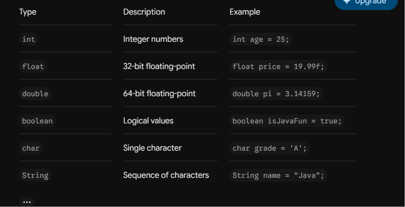

# Basics and Variables

In this folder, you will learn the syntax foundations of Java.

## Concepts covered:
- **Main Method**: The entry point of every Java program (`public static void main(String[] args)`).
- **Data Types**: Primitive types (`int`, `double`, `boolean`, `char`) and Reference types (`String`).
- **Variables**: Declaration and initialization.
- **Console I/O**: Printing output using `System.out.println()` and taking user input with `Scanner`.

2. Data Types and VariablesJava is statically typed, meaning you must declare the type of a variable upon creation.Primitive TypesThese store simple values directly in memory.TypeDescriptionExampleintInteger numbersint age = 25;float32-bit floating-pointfloat price = 19.99f;double64-bit floating-pointdouble pi = 3.14159;booleanLogical valuesboolean isJavaFun = true;charSingle characterchar grade = 'A';Reference TypesThese store references to objects.String: Used for sequences of characters.Javapublic class Variables {
    public static void main(String[] args) {
        int count = 10;
        float rate = 5.5f; // Note the 'f' suffix for floats
        double balance = 1500.50;
        String message = "Hello, Java!";
        
        System.out.println(message);
        System.out.println("Rate: " + rate);
    }
}
3. Console Input and OutputJava uses System.out for output and the Scanner class (from java.util) for reading input.Javaimport java.util.Scanner;

public class ConsoleIO {
    public static void main(String[] args) {
        Scanner sc = new Scanner(System.in);
        
        System.out.print("Enter a floating point number: ");
        float userFloat = sc.nextFloat();
        
        System.out.println("You entered: " + userFloat);
        
        sc.close();
    }
}
"""with open("Java_Basics.md", "w") as f:f.write(markdown_content)

2. Data Types and Variables
Java is statically typed, which means you must declare the data type of every variable before using it. Once a variable is declared as a specific type, its type cannot change.

Primitive Types: Store simple values directly in memory.

Reference Types: Store references (memory addresses) to objects.

Data types examples:

Floating-Point Precision: Remember that decimal literals are treated as double by default. If you want to use a float, you must append f or F to the value (e.g., float rate = 5.5f;).

3. Console I/O
Java uses System.out for printing to the console and the Scanner class (located in the java.util package) to read input from the user.

Example: Console Input and Output

import java.util.Scanner; // Import the Scanner class

public class ConsoleIO {
    public static void main(String[] args) {
        // Create a Scanner object to read input
        Scanner sc = new Scanner(System.in);
        
        System.out.print("Enter your age: ");
        int age = sc.nextInt(); // Reads an integer
        
        // println adds a new line, print keeps it on the same line [cite: 33]
        System.out.println("You are " + age + " years old.");
        
        sc.close(); // Good practice to close the scanner
    }
}

